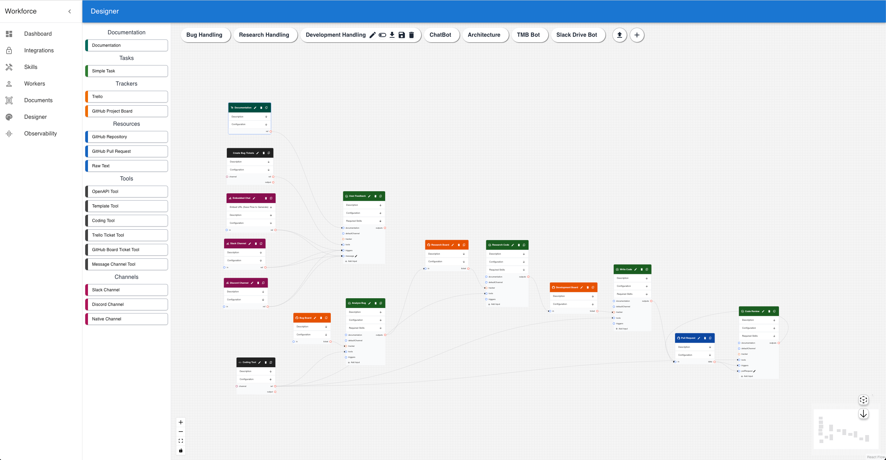

# Workforce

#### *Define processes, deliver value.*


## Join the Community


## Overview

(Skip to the [Local Demo](#local-demo) section to get started quickly)

Workforce is an api-driven, multi-tenant, distributed runtime and development tool for LLM-powered automation and experiences. It is designed around a simple declarative specification that allows users to define the work they want done, and the platform manages all of the technical integration and scaling. It can be thought of as an automated task-scheduler on steroids.

The primary design goal is to create a scalable, reliable, and secure platform for automating business processes.

The universality of internal representations allows for straightforward generation of fine-tuning datasets that can be used for training tailored models for specific tasks. This essentially allows an expensive worker to train a lower-cost replacement.

#### *Mange work, not workers.*

Workforce is a **value-centric** platform that focuses on defining the *work* that needs to be done, as opposed to an **agent-centric** platform that focuses on defining *workers*.

The fundamental theory of Workforce is that there is a many-to-many relationship between the skills of workers, and the skills required by work. To optimize for this, rather than thinking of workers as *having roles*, and work being *assigned by roles*, we think of work as *requiring skills*, and workers as *having skills*. A general pool of workers can then be matched to any tasks that match their skillset, rather than creating a complex system of roles and assignments.

The system focuses on optimizing utilization at the minimum possible cost. Task assignment is balanced based on the availability of skills within the pool, the rarity of skills amongst workers, and the current workload of the workers.

#### *Strike a balance between autonomy and control.*

Workforce focuses on working within the confines of the realities of LLMs, while also leveraging their capabilities to fullest.
- They are capable of handling diverse, unstructured inputs
- They are good at translating between different systems
- They can fail in unpredictable ways

Workforce focuses on **high-value** tasks. These are the kinds of tasks that generally require concerted knowledge work, and are difficult to automate with traditional methods due to the complexity and variety of the inputs and outputs.

#### *The more precisely a task is defined, the more likely it is to be successful.*

The key elements of a **task** are:

- **Inputs**: This can be thought of as a bill of materials for the task. It defines the resources that are required to complete the task.
- **Outputs**: The products of the task. The completion of a task is defined by the generation of these outputs, and the purpose of a task should be thought of in terms of the outputs it produces.
- **Documentation**: Supplementary information that may be needed to complete a task.
- **Tools**: These are the **sufficient** set of tools required to complete the task. A task should have no more and no less than the tools required to complete the task.
- **Required Skills**:  A worker must have all of the required skills to be considered for a task.
- **Instructions**: These are the **barely sufficient** set of instructions that inform a worker of the the nature of the task. There should be a clear definition of done and clear acceptance criteria for the task.

A Task Definition should be considered a **complete** definition of the task. The worker should not need to know anything beyond the scope of the task definition, and it should need nothing more than the tools and materials provided in the task definition.

Workforce supports tasks that may typically be considered "agentic" in nature, such as chatbots, coding assistants, and other interactive systems, but the agentic behavior should be considered **synthetic**, as the task definition is what drives the behavior, not the worker.

The most important part of using Workforce comes down to **process definition**. By analyzing business processes and deconstructing them into a set of discrete tasks, you can focus on reducing the error rate of tasks in isolation, allowing for robust, scalable, and reliable automation.

### Example Use Cases
- Customer Support Automation
- Embedded Chatbots w/ Tool Integration
- Headless Coding Automation
- Bug Reporting Directly From Chat
- Interactive Coding Assistants
- Interactive Documentation
- Ticket Management
- Code Review Automation
- Conversational Interfaces
- Data Classification and Aggregation
- SDLC Automation
- Anything Else You Can Imagine

A detailed sequence diagram of the flow of a demonstrative task through the system can be found [here](./docs/TASK_DIAGRAM.md).

Workforce is designed to be implementation-agnostic and can support arbitrary integrations that satisfy the API contract. If you already have well-defined processes, you can use Workforce to automate them without having to change your existing systems.

Workforce supports triggering procedures from arbitrary interfaces, and it can support complex workflows that span across multiple external systems.

The built-ins provide a starting point for common use cases, but the system is designed to be extensible and allow the broader community to build and share their own integrations.

Flows can span multiple tasks and systems. A relatively simple flow can create large dynamic behavior.

## Disclaimer

A lot of time was borrowed from the future early on in this project. There is tech debt. The interface definitions are fairly defined, but individual implementations may be a bit rough around the edges.

One of the key long term design goals is for implmentations to be maintained entirely separately from the core runtime so that they can be worked on independently by the community.

The core runtime is planned to be re-written in Go. The current implementation is a prototype intended to explore the design space through rapid iteration.

# Additional Components

## Excelsior

This repository also contains a chat interface called Excelsior that allows you to interact with flows in a conversational manner. It demonstrates how to make use of the rich tooling provided by the channel interface to build interactive, collaborative applications with complex, dynamic structures.

For collaborative tool sessions, it currently supports a browser-hosted python interpreter, an iframe host for arbitrary web content, which can be used for Google Slides, or other web-based interfaces that have a backing API, and an Excalidraw whiteboard.


## VS Code Extension

The Coding Tool connects to a VS Code extension that gives the system deep integration with the IDE. In local mode, tasks that use the coding tool will connect to VS Code locally on the end-user's machine. In remote mode, a Kubernetes pod will be spun up with a remote VS Code server, and the end user can connect to a dynamically-generated URL through their browser.

Repositories used with the Coding Tool require a custom index.json file that defines the structure of the repository. This file is used to provide context to the Coding Tool and to allow it to navigate the repository and follow patterns. Presently, this file must be created manually, but it is well within the capabilities of the system itself to build a flow that can generate this file, it just may be cost-prohibitive to achieve the level of fidelity required to make the coding tool maximally useful.

The Coding Tool can function on projects of arbitrary size and will happily make changes that span many files and directories. It is designed to be able to operate entirely autonomously, but can also be used in a more interactive mode where the user is prompted for input.

## CLI

The CLI wraps the API and provides a convenient way to interact with the system. It can be used to push objects to the server, pull objects from the server, and interact with the chat interface.

The system was designed so that you can manage your own flows in version control, and CI sytems can use the CLI to push changes to the server.

You can even create a flows in Workforce to help manage and collaborate on the development of your flows!

## Workforce UI

The Workforce UI is a web-based interface that allows you to interact with the workforce server. It allows you to create and manage objects, view logs, and includes a rich GUI for building flows.



## Embedded Chat

The Embedded Chat is a web-based chat interface that allows you to inject a chat interface into any web page. It can be included in any web page by adding a script tag and the appropriate configuration.

# Fundamentals

The Workforce API is composed of the following primitives:

- **Flow**: A flow is the top-level unit defining a process and serves to logically group objects together. It is the highest level of abstraction in the system and is used to define the overall process that you want to automate. 

- **Task**: A task is a unit of work that is executed by a worker. It is the smallest unit of work in the system and is used to define the individual steps that make up a flow. Tasks have defined inputs, and outputs, and can have sub-tasks, which allows you to build complex, dynamic workflows.

    Tasks should be thought of in the following way:

- **Channel**: A channel is a communication mechanism that allows interaction with the system. It is used to both trigger tasks and to provide conversational interfaces.

- **Resource**: A resource is a reference to versioned data that is used by tasks. It is used to provide input to tasks and to store output from tasks. It can serve as both a trigger and a supplement to tasks. As an input, this can be thought of as a simple form of retrieval-augmented-generation. As an output, this should be thought of as a form of artifact management.

- **Tool**: A tool is a reference to an external system that is used by tasks. Workers will automatically determine the best tools to use based on the task definition. There are several built-in tools, but any API with an OpenAPI specification can be used as a tool.

- **Tracker**: A tracker is a reference to a tracking system that is used by tasks. It is used to provide visibility into the status of tasks and flows. Trackers are considered first-class citizens of the system to facilitate fully automated flows managed entirely by trackers like Jira, GitHub, or Trello.

- **Document Repository**: A document repository is a reference to a system that stores documents that can be used by tasks. It is used to provide context to tasks and to store output from tasks. The internal runtime will manage the vectorization of documents to support retrieval-augmented-generation. The current implementation relies on Weaviate and the OpenAI API, but the interface is designed to be pluggable.

- **Worker**: A worker is a process that executes tasks. It uses the task specification, including tools, resources, documentation, trackers, and channels to perform the work. It is responsible for managing the lifecycle of the task and reporting the results back to the system. Workers connect to external systems to perform inference based on the current task context. Workers are devoid of any business logic and are designed to be stateless and ephemeral.

    While typically this will be an LLM, an experimental UI exists that allows for a Human to act as a worker. Because Human and Machine Workers share the same internal representation, Human workers can test flows, take over for Machine Workers, or generate training data for Machine Workers.

- **Skill**: Skills associate workers with tasks. A task has a set of required skills, and a worker has a set of provided skills. The system will automatically match workers to tasks based on the required skills.

## What makes Workforce tools different?

Workforce makes use of tools to perform dynamic interactions during tasks.

Tools in Workforce allow for multiple readers and multiple writers by maintaining a versioned state. This means an end-user can update an external resource (like a Google Slides presentation, or a file during a coding session), and the system will be made aware of the changes when the next interaction occurs.

These are represented as "Machine State" and "Human State" in the system. The Machine State is the representation of the state as seen by the LLM, and the Human State is the representation of the state as seen by the end-user.

Tools have the capability of producing side-effects, and in the context of a task, this fact should be considered with care. Outputs from tasks can contain references to tools, such that the side-effects can be accounted for upon completion. For example, the coding tool may commit and push changes to a repository, and the output of the task may receive from the tool a reference to the commit to create a pull request.


# Example SDLC Flow Composition

The following is an illustrative example of the relationship between a flow and the behaviors that result from the flow definition.

## Tasks

- Task: ChatBot
    - Tool: Bug Report
    - Tool: Feature Request
    - Input: Native Channel
    - Trigger: Native Channel

- Task: Bug Report
    - Tracker: Bug Tracker
    - Channel: Production Support
    - Tool: Collaborative Coding
        - Channel: Native Channel
        - Repository: Git
    - Output: Pull Request

- Task: Feature Request
    - Tracker: Product Review
    - Channel: Product Review
    - Output: Architecture Ticket

- Task: Architecture Review
    - Tracker: Architecture Review
    - Channel: Architecture Review
    - Tool: Collaborative Architecture
        - Channel: Native Channel
        - Repository: Git
    - Output: Design Ticket

- Task: Software Design
    - Tracker: Software Design
    - Tool: Collaborative Coding
        - Channel: Native Channel
        - Repository: Git
    - Output: Development Ticket

- Task: Coding Session
    - Tracker: Development Ticket
    - Tool: Collaborative Coding
        - Channel: Native Channel
        - Repository: Git
    - Tool: Direct Message
        - Channel: Slack
    - Input: Pull Request
    - Output: Pull Request

- Task: Code Review
    - Tracker: Development Ticket
    - Tool: Automated Coding
        - Repository: Git
    - Input: Pull Request
    - Output: Pull Request

## Resulting Behavior


## Local Demo

### Limitations

In the default configuration, the local demo does not support webhooks.

In order to make use of webhooks, please refer to the [Kubernetes Deployment Guide](./_deploy/kubernetes/terraform/README.md) for instructions on deploying Workforce to Kubernetes.
### Prerequisites

- Docker
- Node.js (v18+)

#### 1. Clone this repository
```bash
git clone https://github.com/workforce-oss/workforce.git
```
#### 2. Change to the workforce directory
```bash
cd workforce
```

#### 3. Start the local demo
```bash
npm run docker:local
```

## Loading examples

You can use the CLI to load examples into the local server. The examples are located in the `examples` directory.

#### 1. Log in to the local server

The default username for the local demo is `admin` and the default password is `admin`.

This can be reconfigured in the `_deploy/docker/local/workforce-server.env` file.

```bash
./cli.sh login
```

#### 2. Add a Worker

Add your api key to `examples/anthropic.yaml` or `examples/openai.yaml`.

Push the worker to the local server
```bash
./cli.sh push examples/workers/anthropic.yaml
```
or
```bash
./cli.sh push examples/workers/openai.yaml
```

#### 3. Load an example flow
```bash
./cli.sh push examples/excelsior/hello-world.yaml
```

#### 4. Get a url to access the Excelsior UI for the flow
```bash
./cli.sh exl
```

#### Additional Details

If you want to use examples with documents that reference document repositories, you will need to also push a document repository from `examples/document-repositories`.

The example git document repository will automatically pull in and index files that match a regular expression from the repository, making them available as documentation in flows.

## Installing the VS Code Extension

The VS Code extension is not yet published to the marketplace, so you will need to install it manually.

With the local demo running, you can install the extension by following these steps:

#### 1. Download the vsix file from the following link:
[http://localhost:8084/vscode-server/extension.vsix](http://localhost:8084/vscode-server/extension.vsix)

#### 2. Open the Extensions view by clicking on the square icon in the sidebar or pressing `Ctrl+Shift+X` (Cmd+Shift+X on macOS).

#### 3. Click on the `...` in the top right corner of the Extensions view and select `Install from VSIX...`.

#### 4. Select the downloaded vsix file.

#### 5. Reload VS Code.

## Workforce UI

The workforce UI is a web-based interface that allows you to interact with the workforce server. It allows you to create and manage objects, view logs, and includes a rich GUI for building flows.

The UI is available at `http://localhost:8084/workforce-ui` by default.

### Overview

* **Dashboard**: The dashboard shows an overflow of the system including flows, task statistics, and worker statistics.

* **Integrations**: Manage credentials used to authenticate with external systems. These are shared across all flows.

* **Skills**: Manage the skills that associate workers with tasks. These are shared across all flows.

* **Workers**: Manage the workers that execute tasks. These are shared across all flows.

* **Documents**: Manage documents than can be used for Retrieval-Augmented-Generation and included in flows.

* **Designer**: The designer is a visual interface for building flows. It allows you to drag and drop objects onto a canvas and connect them together to define the process you want to automate.

* **Observability**: View logs of task executions. You can delete started task-executions from this interface if they are stuck or can no longer be completed. Started task-executions count agains the wipLimit of the worker, so it is important to clean up any that are no longer needed to prevent the worker from being blocked. Completed task-executions do not count against the wipLimit.

## Additional Deployment Options

### Kubernetes

See the [Kubernetes Deployment Guide](./_deploy/kubernetes/terraform/README.md) for instructions on deploying Workforce to Kubernetes.