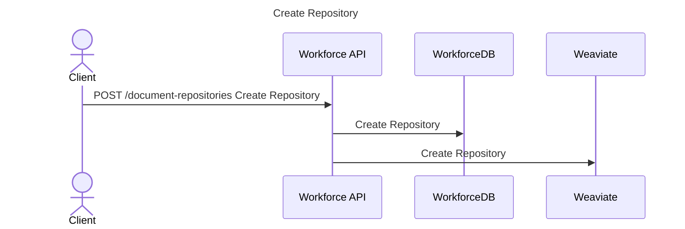
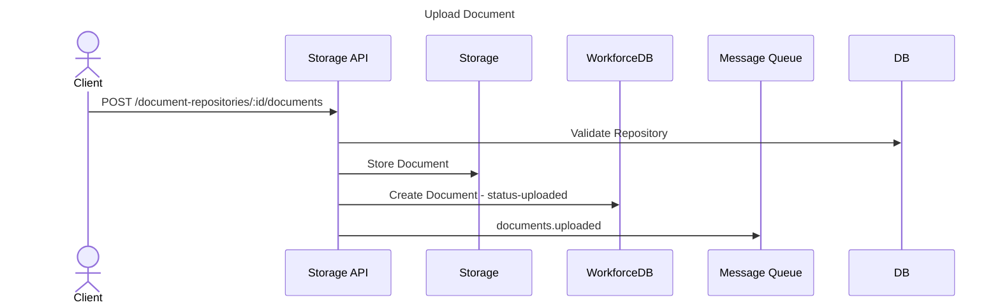
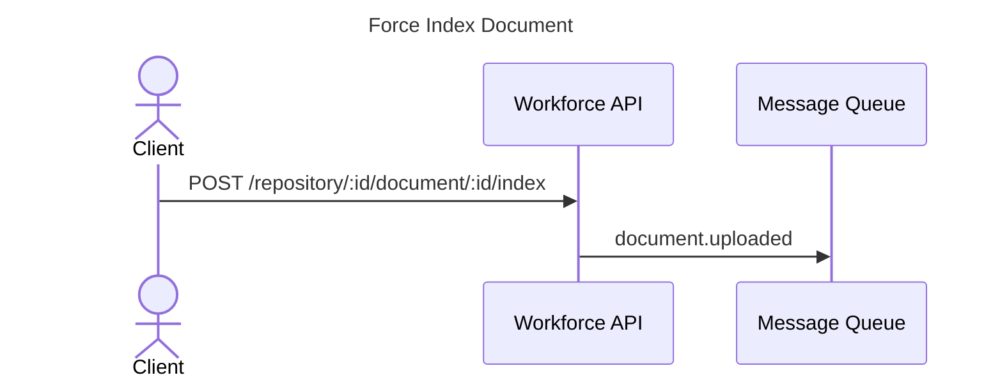
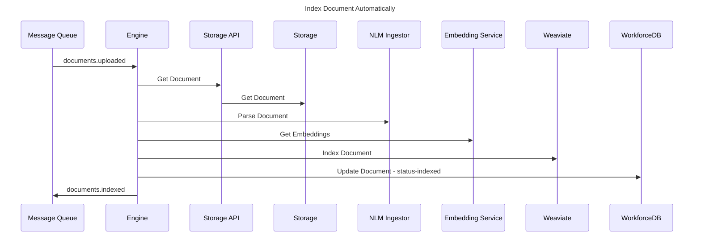

```mermaid
sequenceDiagram
    title Create Repository
    actor C as Client
    participant WA as Workforce API
    participant WDB as WorkforceDB
    participant WV as Weaviate  

    C->>WA: POST /document-repositories Create Repository
    WA->>WDB: Create Repository
    WA->>WV: Create Repository
```

```mermaid
sequenceDiagram
    title Upload Document
    actor C as Client
    participant SA as Storage API
    participant S as Storage
    participant WDB as WorkforceDB
    participant M as Message Queue

    C->>SA: POST /document-repositories/:id/documents
    SA->>DB: Validate Repository
    SA->>S: Store Document
    SA->>WDB: Create Document - status-uploaded
    SA->>M: documents.uploaded
```

```mermaid
sequenceDiagram
    title Force Index Document
    actor Client
    participant WA as Workforce API
    participant M as Message Queue
    
    Client->>WA: POST /repository/:id/document/:id/index
    WA->>M: document.uploaded
```

```mermaid
sequenceDiagram
    title Index Document Automatically
    participant M as Message Queue
    
    participant E as Engine
    participant SA as Storage API
    participant S as Storage
    participant NLM as NLM Ingestor
    participant EM as Embedding Service
    participant WV as Weaviate
    participant WDB as WorkforceDB

    M->>E: documents.uploaded
    E->>SA: Get Document
    SA->>S: Get Document
    E->>NLM: Parse Document
    E->>EM: Get Embeddings
    E->>WV: Index Document
    E->>WDB: Update Document - status-indexed
    E->>M: documents.indexed
```