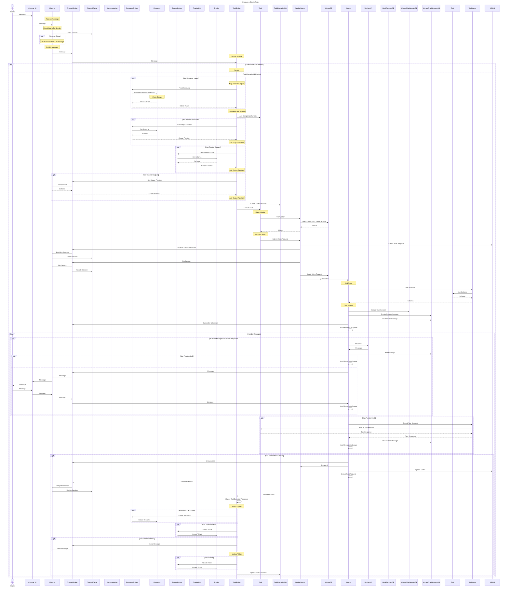

```mermaid
sequenceDiagram
    title Execute a Simple Task
    actor Client

    participant CUI as Channel UI
    participant C as Channel
    participant CB as ChannelBroker
    participant CC as ChannelCache
    
    participant D as Documentation

    participant RB as ResourceBroker
    participant R as Resource


    participant TRB as TrackerBroker
    participant TRDB as TrackerDB
    participant TR as Tracker

    participant TB as TaskBroker
    participant T as Task
    participant TEDB as TaskExecutionDB

    participant WB as WorkerBroker
    participant WDB as WorkerDB
    participant W as Worker
    participant WAPI as WorkerAPI
    
    participant WR as WorkRequestDB
    participant WCSDB as WorkerChatSessionDB
    participant WCMDB as WorkerChatMessageDB

    participant TL as Tool
    participant TLB as ToolBroker
    
    Client->>CUI: Message

    note over C: Receive Message
    CUI->>C: Message
    note over C: Check Cache for Session
    C->>CC: Check Session
    opt Session Exists
        note over C: Add TaskExecutionId to Message
    end
    note over C: Publish Message
    C->>CB: Message

    note over TB: Trigger Listener
    CB->>TB: Message
    alt TaskExecutionId Present
        note over TB: ignore
    else TaskExecutionId Missing

        opt Has Resource Inputs
        note over TB: Map Resource Inputs
        TB->>RB: Fetch Resource
        RB->>R: Get Latest Resource Version
        note over R: Fetch Object
        R-->>RB: Return Object
        RB-->>TB: Object Value
        end
        
        note over TB: Create Function Schema
        TB->>T: Add Completion Function
        
        opt Has Resource Outputs
        TB->>RB: Get Output Function
        RB->>R: Get Schema
        R-->>RB: Schema
        RB-->>TB: Output Function
        note over TB: Add Output Function
        end

        opt Has Tracker Outputs
        activate TRB
        TB->>TRB: Get Output Function
        TRB->>TR: Get Schema
        TR-->>TRB: Schema
        TRB-->>TB: Output Function
        note over TB: Add Output Function
        end

        opt Has Channel Outputs
        TB->>CB: Get Output Function
        CB->>C: Get Schema
        C-->>CB: Schema
        CB-->>TB: Output Function
        note over TB: Add Output Function
        end

        TB->>TEDB: Create Task Execution
        TB->>T: Execute Task

        note over T: Match Worker
        T->>WB: Find Worker
        WB->>WDB: Match Skills and Channel Access
        WDB-->>WB: Worker
        WB-->>T: Worker

        note over T: Request Work
        T->>WB: Submit Work Request
        WB->>WRDB: Create Work Request
        
        WB->>CB: Establish Channel Session
        CB->>C: Establish Session
        C->>CC: Create Session

        WB->>CB: Join Session
        CB->>C: Join Session
        CB->>CC: Update Session

        WB->>WDB: Create Work Request
        WB->>W: Queue Work

        note over W: Add Tools
        W->>TLB: Get Schemas
        TLB->>TL: Get Schema
        TL-->>TLB: Schema
        TLB-->>W: Schema

        note over W: Chat Session
        W->>WCSDB: Create Chat Session
        W->>WCMDB: Create System Message
        W->>WCMDB: Create User Message

        W->>CB: Subscribe to Session
        W->>W: Add Messages to Queue

        loop Handle Messages
            opt Is User Message or Function Response
                W->>WAPI: Inference
                WAPI->>W: Message
                W->>WCMDB: Add Message

                alt Has Function Call
                W->>W: Add Message to Queue
                else
                W->>CB: Message
                CB->>C: Message
                C->>CUI: Message
                CUI->>Client: Message
                Client->>CUI: Message
                CUI->>C: Message
                C->>CB: Message
                CB->>W: Message
                W->>W: Add Message to Queue
                end
            end
            opt Has Function Call
                W->>TLB: Submit Tool Request
                TLB->>T: Handle Tool Request
                T-->>TLB: Tool Response
                TLB-->>W: Tool Response
                W->>WCMDB: Add Function Message
                W->>W: Add Message to Queue
            end
            opt Has Completion Function
                W->>CB: Unsubscribe
                
                W->>WB: Respond
                W->>WRDB: Update Status
                W->>W: Queue Next Request
                
                WB->>CB: Complete Session
                CB->>C: Complete Session
                C->>CC: Update Session

                WB->>TB: Send Response
                TB->>TB: Map to TaskExecutionResponse
                
                note over TB: Write Outputs
                
                opt Has Resource Output
                TB->>RB: Create Resource
                RB->>R: Create Resource
                end

                opt Has Tracker Output
                TB->>TRB: Create Ticket
                TRB->>TR: Create Ticket
                end

                opt Has Channel Output
                TB->>CB: Send Message
                CB->>C: Send Message
                end

                note over TB: Update Ticket
                opt Has Tracker
                TB->>TRB: Update Ticket
                TRB->>TR: Update Ticket
                end

                TB->>TEDB: Update Task Execution
            end
        end

    end

```