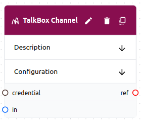

# Channel

A **channel** is a type of **object** that can be used in a **flow**. A **channel** is a way for workers to communicate in real-time with users or other workers. **Channels** can be used as **inputs**, **outputs**, or **triggers** for **tasks**.



## Schema

```yaml
# Common Fields
name: string, required # Must be unique within the flow
description: string, optional
type: string, required # The type of channel
variables: map # The variables schema depends on the type
credential: string, optional # A reference to a credential if the type requires one
```

## Usage

- **Tasks** can map channels to **inputs**. The latest message in the channel will then fill in **task variable templates**.

```yaml
channel:
  name: robot-dev-slack
task:
  inputs:
    message: robot-dev-slack # This is a reference to the channel
  variables:
    prompt_template: | # The first message in the channel will fill in the template1
    {{message}} 
```

- **Tasks** can map channels to **outputs**. The **task** will then send a message to the **channel** when it completes.

```yaml
channel:
  name: robot-dev-slack
task:
  outputs:
    - robot-dev-slack # Reference the channel by name
```

- **Tasks** can use channels as  **triggers**. The task will be triggered when a new message is sent to the **channel**.

```yaml
channel:
  name: robot-dev-slack
task:
  triggers:
    - robot-dev-slack # <--- This is a reference to the channel
  inputs:
    message: robot-dev-slack # <--- Add the input if you want to use it in a variable
```

- **Tasks** can be assigned a **default channel**. This allows the worker to send messages to the channel without the **task** using the channel an **input**. For example, a task to gather design details from an architect may be triggered by a **tracker**. The **worker** can then use the **default channel** to communicate with the architect.

```yaml
channel:
    name: robot-dev-slack
task:
    defaultChannel: robot-dev-slack # <--- This is a reference to the channel
```