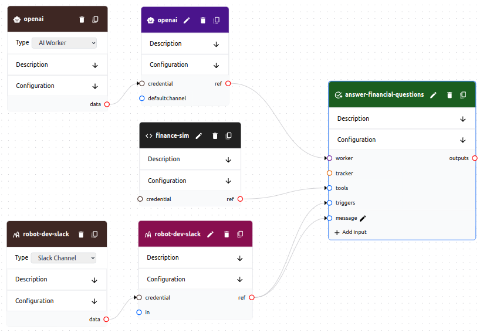

# Flow

A flow is a collection of **tasks**, **documentation**, **resources**, **channels**, **trackers**, and **tools**.

A flow is represented as a directed graph. Cycles are allowed, but should be used with care. Flows can be created using either the web interface or the command line interface.

Objects in flows have **types** which dictate their behavior. Variables differ between types. See the documentation for each type for more information.

Sensitive values are stored in **credentials**. Credentials are referenced by objects in flows. Credentials are stored in a separately and are encrypted both at rest and in transit. Credentials are global to an organization and can be created using either the web interface or the command line interface.

## Schema

```yaml
name: string, required # Must be unique within the flow
description: string, optional
status: string, optional # Can be active or inactive. Defaults to inactive
channels: list, optional # A list of channels
resources: list, optional # A list of resources
tasks: list, optional # A list of tasks
trackers: list, optional # A list of trackers
tools: list, optional # A list of tools
```

## Example

This is an example of a **flow** that uses a **channel**, **tool**, and **task** to create a chatbot in a Slack channel *#robotdev* to answer questions about finances.

It has access to a **tool** that can simulate a financial situation. 

This flow can be executed in parallel for multiple conversations. Each conversation has Slack its own thread with its own **worker**.

Each thread continues independently until the worker determines that the conversation is over.

A **worker** must exist with the skill `finance`, and the work must also have a **channel_token** for `slack`.

##### Web UI



##### YAML
```yaml
name: Helpful Accountant
description: A robot that answers questions about your finances
status: active

channels:
- name: robot-dev-slack
  description: robotdev channel
  type: slack-channel
  credential: robot-dev-slack
  variables:
    channel: robotdev


tools:
- name: finance-sim
  description: A tool that simulates a financial situation
  type: openapi-tool
  variables:
    schema_url: http://example.com/schema

tasks:
- name: answer-financial-questions
  description: Answer questions about finances
  type: simple-task
  skills: 
    - finance
  tools: 
  - finance-sim
  triggers:
  - robot-dev-slack
  inputs:
    message: robot-dev-slack
  variables:
    system_message_template: |
      You are a helpful accountant who answers questions about a user's finances.

      The task is complete when the users has no more questions.
    prompt_template: |
      {{message}}
```

## Explanation

#### Channel Definition

The **slack-channel** is smart enough to manage threads for conversations. Every time a new message comes into the #robotdevs channel, the **slack-channel** creates a new thread for the conversation and kicks off the task. The **worker** is assigned to the thread and can respond to messages in the thread.

```yaml
channels:
- name: robot-dev-slack
  description: robotdev channel
  type: slack-channel # <--- This is a Slack channel
  credential: robot-dev-slack
  variables:
    channel: robotdev # <--- This is the channel name
```

#### Tool Definition

The **openapi-tool** provides a **schema** that explains how to use it. The **worker** uses the **schema** to determine how to use the **tool**. In this case, the worker can use the **tool** to simulate a financial situation. It will then synthesize a response to the user's question based on the simulation data.

The platform will automatically validate the **schema** and ensure that the **worker** uses the **tool** correctly. The platform makes use of the security and server information in the **schema** to ensure that the **tool** is used securely and correctly.

```yaml
tools:
- name: finance-sim
  description: A tool that simulates a financial situation 
  type: openapi-tool
  variables:
    schema_url: http://example.com/schema # <--- This is a reference to the schema
```

#### Task Channel Usage

The **simple-task** is triggered by a message in a Slack channel. The message is used as an **input** to the task. The **channel** is then passed to the **worker** so that it can send messages back to the channel.

The **simple-task** has a configurable system message and prompt that are given to the **worker** when the task is triggered.

```yaml
tasks:
- name: answer-financial-questions
  type: simple-task # <--- This is a simple task
  ...
  triggers:
    - robot-dev-slack # <--- This is a reference to the channel
  inputs:
    message: robot-dev-slack # <--- This is a reference to the channel
  variables:
    ...
    prompt_template: | # <--- The prompt can use the input
      {{message}} 
```

#### Task Tool Assignment

The **task** also has access to a **tool** that allows it to simulate a financial situation. The tool is passed to the **worker** when the task is triggered.

```yaml
tasks:
- name: answer-financial-questions
  ...
  tools: 
  - finance-sim # <--- This is a reference to the tool
```