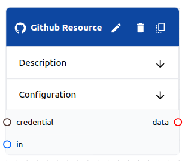

# Resource

A **resource** is a type of object that be used in a **flow**. **Resources** provide tasks with access to external resources. **Resources** track **versions** of the data that they store.

Resource values are fixed when the task is executed. If you want a worker to have dynamic access during task execution, use a [tool](../tools/tool.md).



## Schema

```yaml
# Common Fields
name: string, required # Must be unique within the flow
description: string, optional
type: string, required # The type of resource
variables: map # The variables schema depends on the type
credential: string, optional # A reference to a credential if the type requires one
```

## Usage

- **Tasks** can map resources to **inputs**. The latest **resource version** will then fill in **task variable templates**.

```yaml
resource:
  name: my-resource
task:
  inputs:
    data: my-resource # <--- This is a reference to the resource
  variables:
    prompt_template: | # <--- The latest version of the resource will fill in the template
    {{data}}
```

- **Tasks** can map resources to **outputs**. The **task** can then use the **resource** to store data. The runtime will automatically create a new **version** of the **resource** when the **task** completes.
    
```yaml
resource:
  name: my-resource
task:
  outputs:
    - my-resource # <--- This is a reference to the resource
```

- **Tasks** can use resources as  **triggers**. The task will be triggered when the **resource** receives a new **version**.

```yaml
resource:
  name: my-resource
task:
  triggers:
    - my-resource # <--- A new version of the resource will trigger the task
  inputs:
    data: my-resource # <--- Add the input if you want to use it in a variable
```