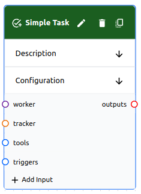

# Task

A **task** is a type of **object** that can be used in a **flow**, and it is at the core of the Workforce runtime. A **task** is a unit of work that can be performed by a human or AI. It contains a definition of everything needed to perform the task, including **inputs**, **outputs**, **documentation**, **tools**, and **triggers**.



## Schema

```yaml
# Common Fields
name: string, required # Must be unique within the flow
description: string, optional
type: string, required # The type of task
variables: map # The variables schema depends on the type
credential: string, optional # A reference to a credential if the type requires one

# Task Fields
requiredSkills: []string, optional # A list of skills required to perform the task
tracker: string, optional # A reference to a tracker to automatically create a ticket for tracking
documentation: []string, optional # A list of references to documentation objects
inputs: map, optional # A map of input names to resources or channels
outputs: []string, optional # A list of resources, channels, or tracker names
tools: []string, optional # A list of tool names that can be used to assist with performing the task
triggers: []string, optional # A list of resource or channel names that can trigger the task
```

## Inputs

**Tasks** are assigned any number of named **inputs**. These inputs are a map of arbitrary strings to resources or channels. Any input can be referenced in task **variables** using the `{{input_name}}` syntax.

## Outputs

**Tasks** can be assigned any number of **outputs**. Outputs are a flat list of resources, channels, or tracker names. The runtime automatically determines the type of each output and handles it appropriately.

The **output** of a task can be used as the **input** of another task. This allows for complex workflows to be created.

## Required Skills

**Tasks** can be assigned a list of **skills** that are required to perform the task. Skills can be used to match workers with tasks that they are qualified to perform.

## Tools

**Tasks** can be associated with any number of **tools** that can be used to assist with performing the task. Examples include APIs, databases, and more.

## Triggers

**Tasks** are also assigned one or more **triggers** that determine when the task should be executed.

Triggers can be **resources** or **channels**. 

* A **resource** trigger will cause the task to be executed when the resource is updated (e.g. a file is uploaded).
* A **channel** trigger will cause the task to be executed when a message is sent to the channel. The channel will be passed to the worker so that it can be used to send messages back to the channel.

## Tracker

**Tasks** will automatically create a ticket in a tracker if a **tracker** is assigned to the task. Tasks will also **execute automatically** if a new ticket matching the tracker's configuration is created.

The runtime will automatically translate any type of tracker into a common schema that can be used by tasks. This allows for tasks to be written in a way that is independent of the tracker being used.

The tracker makes the following properties available to task **variables**:

- `{{ticket.id}}` - The ID of the ticket
- `{{ticket.name}}` - The name or title of the ticket
- `{{ticket.description}}` - The description or body of the ticket


