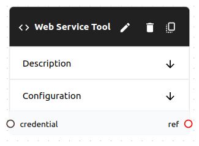

# Tool

A **tool** is a type of object that can be used in a **flow**. **Tools** provide tasks with real-time access to external integrations during task execution. **Tools** are supplied to **tasks** and used by **workers**.

Tools can have interfaces for both **human** and **AI** workers. For example, an **open-api-tool** will present an HTTP API interface to an AI worker, but it will present a web interface to a human worker.

Tools are similar to [resources](../resources/resource.md), but they are intended to be used for real-time access to external integrations. If you want to provide a worker with access to a static resource, use a [resource](../resources/resource.md).




## Schema

```yaml
# Common Fields
name: string, required # Must be unique within the flow
description: string, optional
type: string, required # The type of tool
variables: map # The variables schema depends on the type
credential: string, optional # A reference to a credential if the type requires one
```

## Usage

- **Tasks** can map tools to **inputs**. Tasks will then pass the tool to the worker when the task is triggered.
    
```yaml
tool:
  name: my-tool
task:
  tools:
    - my-tool # <--- This is a reference to the tool
```
