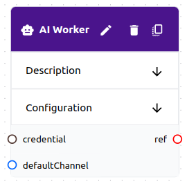

# Worker

A **worker** is a type of root **object**. A **worker** performs **tasks** and is automatically assigned tasks based on skills **Workers** can be either **human** or **AI**.

Workers exist outside of the flow and are managed by the runtime.



## Schema

```yaml
# Common Fields
name: string, required # Must be unique within an organization
description: string, optional
type: string, required # The type of worker
variables: map # The variables schema depends on the type
credential: string, optional # A reference to a credential if the type requires one

# Worker Fields
wip_limit: int, optional # The maximum number of tasks that the worker can have in progress
channel_tokens: map, optional # A map of channel names to channel_user_token credentials
skills: []string, optional # A list of skills that the worker has
```

## Usage

- **Workers** are automatically assigned tasks based on their **skills**. For example, a worker with the skill `design` may be assigned tasks that have the `design` skill requirement.

```yaml
worker:
  name: openai
  wip_limit: 1
  channel_tokens:
    slack-channel: slack-token # A credential reference
    native-channel: native-token # A credential reference
  skills:
    - design
```
