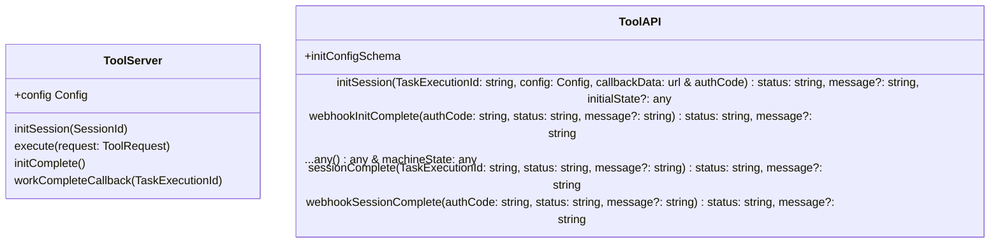

```mermaid
classDiagram
    class ToolServer {
        +config Config
        initSession(SessionId)
        execute(request: ToolRequest)
        initComplete()
        workCompleteCallback(TaskExecutionId)
    }

    class ToolAPI {
        +initConfigSchema

        initSession(TaskExecutionId: string, config: Config, callbackData: url & authCode) status: string, message?: string, initialState?: any
        webhookInitComplete(authCode: string, status: string, message?: string) status: string, message?: string
        
        ...any() any & machineState: any

        sessionComplete(TaskExecutionId: string, status: string, message?: string) status: string, message?: string
        webhookSessionComplete(authCode: string, status: string, message?: string) status: string, message?: string

        
        
    }
```